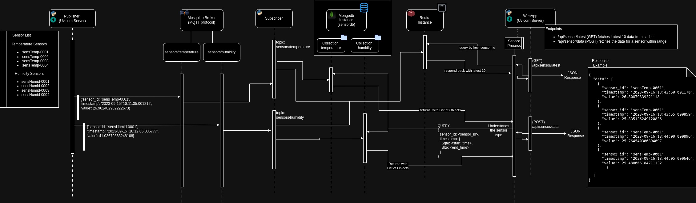

# Flow of Data

This system is designed to efficiently manage the flow of data from a Publisher to a Subscriber, with data being processed, stored, and made accessible through a web application (API). The flow of data is orchestrated through several interconnected services and components, ensuring data integrity, reliability, and accessibility.

**1. Publisher:**

* The Publisher is the initial source of data in the system. It generates data and pushes it into the system.
* It communicates with the Broker to publish data to specific topics.

**2. Broker:**

* The Broker acts as an intermediary, receiving data from the Publisher and forwarding it to Subscribers.
* It is responsible for topic*based message routing and delivery.
* The Broker maintains a list of active Subscribers for each topic.

**3. Subscriber:**

* Subscribers subscribe to specific topics of interest within the Broker.
* When data is published to a subscribed topic, the Subscriber receives and processes the data.
* In this system, the Subscriber performs two key tasks:
    * It stores the received data in a cache for quick access and retrieval.
    * It also stores the data in a database for long-term storage and analysis.

**4. Cache:**

* The cache acts as a high*speed, in*memory storage system for recently received data.
* It enables rapid data retrieval for real*time or frequently accessed information.
* The cache enhances system performance by reducing the need to access the database for every data request.

**5. Database:**

* The database serves as the long*term data storage solution.
* It stores historical and persistent data that can be queried and analyzed over time.
* Data in the database is structured, indexed, and optimized for efficient retrieval.

**6. Web Application/API:**

* The web application provides an interface for users to access and query the data stored in the system.
* It communicates with both the cache and the database to retrieve data based on user requests.
* Users can access real*time and historical data through the API, making it a central point for interacting with the system.

## **Data Flow Summary:**

* Data originates from the Publisher and is channeled through the Broker.
* Subscribers receive, process, and store data in both the cache and the database.
* The cache serves as a performance*enhancing layer, while the database stores long*term data.
* The web application/API connects to both the cache and the database, providing users with seamless access to data.

This orchestrated data flow ensures that data is efficiently collected, stored, and made available for consumption, catering to real*time and historical data needs within the system.

Flow of Data

---
Jump into:

* Previous: [Architecture & Design](./design.md)
* Next: [API Documentation](./apidoc.md)

 &emsp;&emsp;[Table of Contents](./docs.md) 

---
&copy; [Bishal Biswas](mailto:b.biswas_94587@ieee.org)
