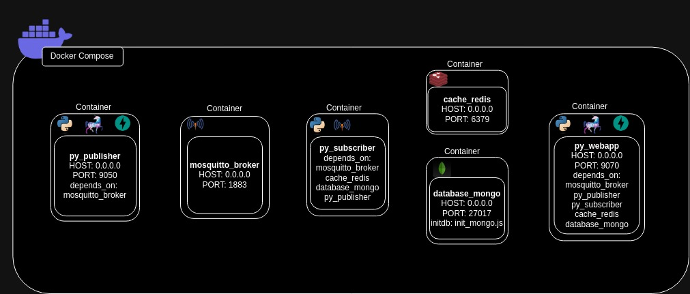
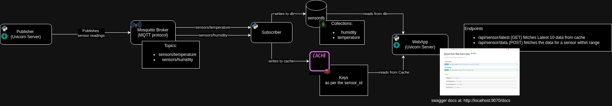

# Architecture & Design

The Project required us to set up various functionalities ([check here](../coding_problem.md)) in a single **_docker-compose.yaml_** file to start all the various systems.

To account for the some design liberties as well as sticking to best practices for a RESTful suite of services the Docker-Compose is structured in a way as shown below

Docker-Compose structure

and the services are created according to the following design.

Service Design

Each component(container) of the Docker-Compose is described as

1. Mosquitto Broker
    * name: mosquitto_broker
    * host: 0.0.0.0
    * port: 1883

    sets up the eclipse mosquitto broker following the MQTT protocols. It depends on a configuration file which defines the bare minimum MQTT broker to be up. For data to be passed around.
2. Publisher
    * name: py_publisher
    * host: 0.0.0.0
    * port: 9050
    * depends on: mosquitto_broker
    * language: Python 3.11.4

    runs in an ASGI Server Appplication(UVICORN) to send data of the various sensors(total: 8) to the broker at a timed interval of 5 seconds. The service is scheduled to send out a publish message to the broker for all the Temperature sensors together and the Humidity sensors together. This service requires **Mosquitto Broker** service to be up and running before itself starting up.
3. MongoDB Server
    * name: database_mongo
    * host: 0.0.0.0
    * port: 27017
    * initdb: init_mongo.js

    starts a mongodb container for a MongoDB Community Server with fixed admin and passwords along with an initialization database and collections for users who are setting up the service for the first time to have a smooth experience. This also potentially removes application crashes in the startup stages.
4. Redis
    * name: cache_redis
    * host: 0.0.0.0
    * port: 6379

    starts up a redis cache with pre-configured details. This is required by the challenge to implement a chache memory for data to be written into available instantly in short interval without downtime.
5. Subscriber
    * name: py_subscriber
    * listens to: monsquitto_broker
    * depends on: database_mongo, cache_redis and mosquitto_broker
    * language: Python 3.11.4

    subscription service with the sole purpose to keep listening to the subscription channels in the broker(Mosquitto Broker), proccess the data recieved and send them to be stored in the Cache(Redis) and Database(MongoDB Server).
6. WebApp(Device Data Web Application)
    * name: py_webapp
    * host: 0.0.0.0
    * port: 9070
    * depends on: all other services to be up before starting
    * language: Python 3.11.4

    an ASGI Web Server(UVICORN) API Application that provides the APIs for interacting with the data stored in the Cache and Database. Please check [API Documentation](./apidoc.md) for more information on the API endpoints available and querying them.

All these services coordinate together to bring up the service design to fruition.

---
Jump into:

* Previous: [Setup](./setup.md)
* Next: [Flow of Data](./dataflow.md)

 &emsp;&emsp;[Table of Contents](./docs.md) 

---
&copy; [Bishal Biswas](mailto:b.biswas_94587@ieee.org)
